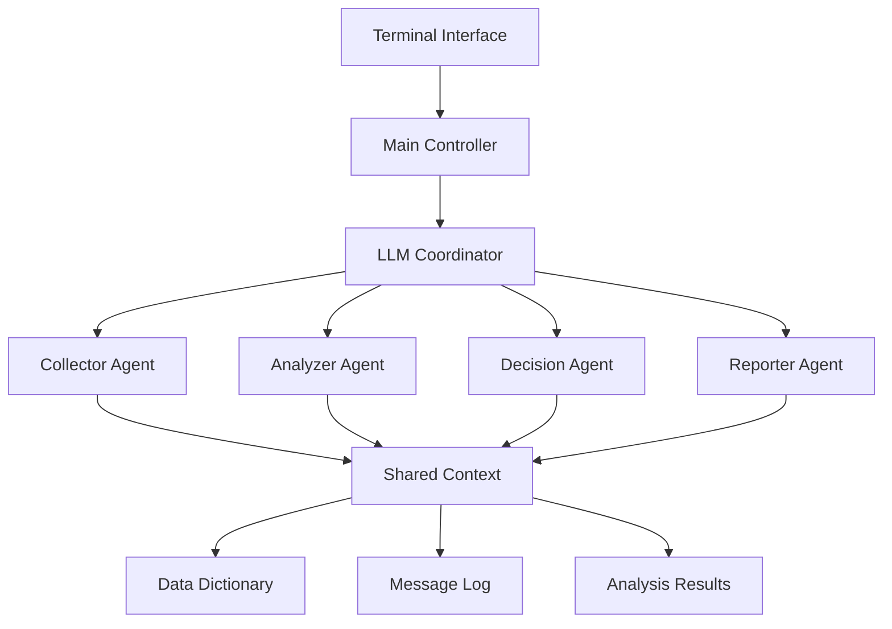

# Design Document: Multi-Agent Data Analyzer

## Overview

The Multi-Agent Data Analyzer is a sophisticated system that leverages specialized AI agents to process CSV data and generate comprehensive analytical reports. The system employs a coordinator pattern with four specialized agents (Collector, Analyzer, Decision, Reporter) orchestrated by a Gemini LLM-powered coordinator. Each agent has distinct responsibilities and communicates through structured JSON protocols to ensure reliable data flow and processing.

The system is designed for terminal-based interaction, making it suitable for server environments and automated workflows. It emphasizes flexibility in analysis capabilities, allowing agents to employ various statistical methods and generate actionable insights from maintenance and operational data.

## Architecture

### System Architecture Pattern

The system follows a **Coordinator Pattern** with hierarchical delegation:



### Core Components

1. **Main Controller**: Entry point that manages user interaction and system lifecycle
2. **LLM Coordinator**: Gemini-powered orchestrator that manages agent communication and provides cognitive capabilities
3. **Specialized Agents**: Four domain-specific agents with distinct responsibilities
4. **Shared Context**: Centralized data store for inter-agent communication
5. **Terminal Interface**: Command-line interface for user interaction

### Communication Flow

Agents communicate through a structured message protocol:
- **Direct messaging** for sequential processing (89% of use cases)
- **Shared state** for collaborative data access
- **Pub/sub pattern** for status broadcasts
- **LLM mediation** for conflict resolution and clarification

## Components and Interfaces

### Agent Base Class

```python
class BaseAgent:
    def __init__(self, name: str, llm_coordinator: LLMCoordinator, shared_context: SharedContext)
    def process(self, input_data: Dict[str, Any]) -> AgentResult
    def send_message(self, recipient: str, message: AgentMessage) -> None
    def receive_message(self, message: AgentMessage) -> None
    def request_llm_assistance(self, query: str, context: Dict) -> str
```

### LLM Coordinator

```python
class LLMCoordinator:
    def __init__(self, api_key: str, model: str = "gemini-1.5-pro")
    def interpret_data_dictionary(self, dictionary: Dict) -> DataSchema
    def resolve_ambiguity(self, query: str, context: Dict) -> str
    def validate_decision(self, decision: Dict, context: Dict) -> ValidationResult
    def generate_explanation(self, technical_content: str, audience: str) -> str
    def coordinate_agents(self, workflow_step: str) -> List[AgentInstruction]
```

### Shared Context

```python
class SharedContext:
    def __init__(self)
    def store_data(self, key: str, data: Any, agent_id: str) -> None
    def retrieve_data(self, key: str) -> Any
    def log_message(self, message: AgentMessage) -> None
    def get_message_history(self, agent_filter: Optional[str] = None) -> List[AgentMessage]
    def update_analysis_state(self, state: AnalysisState) -> None
```

### Agent Message Protocol

```python
@dataclass
class AgentMessage:
    sender: str
    recipient: str
    message_type: MessageType  # REQUEST, RESPONSE, NOTIFICATION, ERROR
    content: Dict[str, Any]
    timestamp: datetime
    correlation_id: str
    priority: Priority  # HIGH, MEDIUM, LOW
```

### Collector Agent

**Responsibilities:**
- CSV file validation and loading
- Data quality assessment
- Missing value detection and handling
- Data type inference and validation
- Initial statistical summary generation

**Key Methods:**
```python
class CollectorAgent(BaseAgent):
    def validate_csv_structure(self, file_path: str) -> ValidationResult
    def detect_data_types(self, dataframe: pd.DataFrame) -> Dict[str, DataType]
    def identify_missing_values(self, dataframe: pd.DataFrame) -> MissingValueReport
    def generate_data_profile(self, dataframe: pd.DataFrame) -> DataProfile
    def normalize_columns(self, dataframe: pd.DataFrame, schema: DataSchema) -> pd.DataFrame
```

### Analyzer Agent

**Responsibilities:**
- Descriptive statistics computation
- Correlation analysis
- Trend detection and time-series analysis
- Anomaly detection using multiple methods
- Feature importance ranking
- Custom aggregation support

**Key Methods:**
```python
class AnalyzerAgent(BaseAgent):
    def compute_descriptive_stats(self, data: pd.DataFrame) -> StatisticalSummary
    def calculate_correlations(self, data: pd.DataFrame) -> CorrelationMatrix
    def detect_trends(self, time_series: pd.Series, date_column: str) -> TrendAnalysis
    def identify_anomalies(self, data: pd.DataFrame, methods: List[str]) -> AnomalyReport
    def perform_clustering(self, data: pd.DataFrame, n_clusters: int) -> ClusteringResult
    def rank_feature_importance(self, features: pd.DataFrame, target: pd.Series) -> FeatureRanking
```

**Statistical Capabilities:**
- Descriptive statistics: mean, median, mode, std, variance, skewness, kurtosis
- Correlation methods: Pearson, Spearman, Kendall
- Anomaly detection: IQR, Z-score, Isolation Forest, Local Outlier Factor
- Time-series analysis: moving averages, seasonal decomposition, trend analysis
- Clustering: K-means, DBSCAN, hierarchical clustering
- Statistical tests: t-tests, chi-square, ANOVA, Kolmogorov-Smirnov

### Decision Agent

**Responsibilities:**
- Recommendation generation based on analysis
- Priority ranking of maintenance actions
- Scenario simulation and impact analysis
- Resource constraint consideration
- Risk assessment and mitigation strategies

**Key Methods:**
```python
class DecisionAgent(BaseAgent):
    def generate_recommendations(self, analysis: AnalysisResult) -> List[Recommendation]
    def prioritize_actions(self, recommendations: List[Recommendation]) -> PriorityMatrix
    def simulate_scenarios(self, base_data: pd.DataFrame, scenarios: List[Scenario]) -> SimulationResult
    def assess_risks(self, recommendations: List[Recommendation]) -> RiskAssessment
    def optimize_resource_allocation(self, actions: List[Action], constraints: ResourceConstraints) -> OptimizationResult
```

### Reporter Agent

**Responsibilities:**
- Report structure generation
- Technical content translation to business language
- Visualization creation (terminal-friendly)
- Executive summary generation
- Multi-format export support

**Key Methods:**
```python
class ReporterAgent(BaseAgent):
    def generate_executive_summary(self, analysis: AnalysisResult, decisions: DecisionResult) -> ExecutiveSummary
    def create_detailed_report(self, all_results: SystemResults) -> DetailedReport
    def generate_visualizations(self, data: pd.DataFrame, chart_types: List[str]) -> List[Visualization]
    def export_report(self, report: Report, format: ExportFormat) -> str
    def translate_technical_terms(self, content: str, glossary: Dict) -> str
```

## Data Models

### Core Data Structures

```python
@dataclass
class DataProfile:
    row_count: int
    column_count: int
    data_types: Dict[str, str]
    missing_values: Dict[str, int]
    unique_values: Dict[str, int]
    memory_usage: float
    sample_data: pd.DataFrame

@dataclass
class StatisticalSummary:
    descriptive_stats: Dict[str, Dict[str, float]]
    correlations: pd.DataFrame
    outliers: Dict[str, List[Any]]
    distribution_tests: Dict[str, Dict[str, float]]

@dataclass
class Recommendation:
    id: str
    title: str
    description: str
    priority: Priority
    estimated_impact: float
    required_resources: List[str]
    timeline: str
    risk_level: RiskLevel
    supporting_evidence: List[str]

@dataclass
class Report:
    executive_summary: str
    methodology: str
    key_findings: List[str]
    recommendations: List[Recommendation]
    technical_details: Dict[str, Any]
    visualizations: List[str]
    appendices: Dict[str, Any]
    generated_at: datetime
```

### Data Dictionary Schema

```python
@dataclass
class ColumnDefinition:
    name: str
    data_type: DataType
    description: str
    unit: Optional[str]
    valid_range: Optional[Tuple[float, float]]
    categorical_values: Optional[List[str]]
    is_nullable: bool
    relationships: List[str]

@dataclass
class DataSchema:
    columns: Dict[str, ColumnDefinition]
    primary_keys: List[str]
    foreign_keys: Dict[str, str]
    business_rules: List[str]
    data_quality_rules: List[str]
```

## Correctness Properties

*A property is a characteristic or behavior that should hold true across all valid executions of a system—essentially, a formal statement about what the system should do. Properties serve as the bridge between human-readable specifications and machine-verifiable correctness guarantees.*

Based on the prework analysis and after eliminating redundant properties, the following correctness properties must be validated:

### Property 1: Agent Communication Protocol Compliance
*For any* agent interaction in the system, all messages exchanged between agents should conform to the structured JSON message protocol with required fields (sender, recipient, message_type, content, timestamp, correlation_id, priority).
**Validates: Requirements 1.2**

### Property 2: Agent Workflow Orchestration
*For any* completed agent task, the system should correctly route the results to the appropriate next agent in the workflow sequence (Collector → Analyzer → Decision → Reporter).
**Validates: Requirements 1.3**

### Property 3: Shared Context Accessibility
*For any* agent in the system, that agent should be able to store data in and retrieve data from the shared context, and all stored communications should be logged.
**Validates: Requirements 1.4, 1.5**

### Property 4: Data Quality Validation and Handling
*For any* CSV dataset with data quality issues (missing values, aberrant values, format inconsistencies), the Collector Agent should detect these issues, flag them appropriately, and continue processing valid data while logging errors with remediation suggestions.
**Validates: Requirements 2.1, 2.2, 2.3, 10.1, 10.2**

### Property 5: Data Dictionary Integration
*For any* provided data dictionary, the system should correctly parse column definitions, identify aggregatable columns based on data types, recognize data type categories (categorical, numerical, temporal), and use this information to guide analysis strategies.
**Validates: Requirements 2.5, 9.1, 9.2, 9.3, 9.4**

### Property 6: Statistical Analysis Completeness
*For any* numerical dataset, the Analyzer Agent should compute all required descriptive statistics (mean, median, mode, standard deviation), correlations, and support multiple aggregation methods (sum, count, percentiles, quartiles) with mathematically correct results.
**Validates: Requirements 3.1, 3.2, 3.6, 8.1**

### Property 7: Time-Series Analysis Capabilities
*For any* time-series dataset, the Analyzer Agent should identify trends, seasonal patterns, and calculate time-based metrics (moving averages, growth rates, seasonality) correctly.
**Validates: Requirements 3.3, 8.3**

### Property 8: Multi-Method Outlier Detection
*For any* dataset with known outliers, the Analyzer Agent should detect them using multiple configurable methods (IQR, Z-score, isolation forest) and provide consistent results across methods.
**Validates: Requirements 3.4, 8.4**

### Property 9: Maintenance Priority Analysis
*For any* maintenance dataset, the Analyzer Agent should generate feature importance rankings and suggest maintenance priorities based on failure rate analysis with supporting evidence.
**Validates: Requirements 3.5, 8.5**

### Property 10: Clustering and Grouping Analysis
*For any* dataset suitable for clustering, the Analyzer Agent should perform clustering analysis to identify data groupings and provide meaningful cluster characteristics.
**Validates: Requirements 8.2**

### Property 11: Decision Generation and Prioritization
*For any* analysis results, the Decision Agent should generate structured maintenance recommendations, prioritize them by criticality and failure probability, and consider resource constraints in scheduling.
**Validates: Requirements 4.1, 4.2, 4.5**

### Property 12: Scenario Simulation Capabilities
*For any* set of proposed maintenance actions, the Decision Agent should create "what-if" scenarios, simulate their impacts, and compare multiple strategies when available.
**Validates: Requirements 4.3, 4.4**

### Property 13: Report Structure and Content
*For any* system analysis results, the Reporter Agent should generate reports with all required sections (executive summary, detailed findings, recommendations), ensure technical terms are explained, and provide export capabilities in multiple formats.
**Validates: Requirements 5.1, 5.3, 5.4, 5.5**

### Property 14: Visualization Generation
*For any* dataset requiring visualization, the Reporter Agent should generate appropriate summary tables and trend visualizations in terminal-friendly formats.
**Validates: Requirements 5.2**

### Property 15: LLM Coordination and Validation
*For any* LLM interaction, the LLM Coordinator should interpret data dictionary semantics, provide contextual explanations when requested, validate agent decisions for logical consistency, reformulate technical content clearly, and resolve ambiguities or request user input when needed.
**Validates: Requirements 6.1, 6.2, 6.3, 6.4, 6.5**

### Property 16: Terminal Interface Functionality
*For any* user interaction, the system should provide terminal-based interface, display data dictionary information and processing status during file loading, show real-time progress updates, and present final reports in terminal-friendly formats.
**Validates: Requirements 7.2, 7.3, 7.4, 7.5**

### Property 17: Custom Aggregation Extensibility
*For any* user-defined custom aggregation function, the Analyzer Agent should be able to apply it to appropriate datasets and return correct results.
**Validates: Requirements 8.6**

### Property 18: Relationship-Aware Analysis
*For any* data dictionary with defined column relationships, the system should leverage these relationships for enhanced correlation analysis and provide more accurate insights.
**Validates: Requirements 9.5**

### Property 19: Communication Resilience
*For any* agent communication failure, the system should retry with exponential backoff and maintain system stability.
**Validates: Requirements 10.3**

### Property 20: LLM Response Validation
*For any* LLM response used in analysis, the system should validate the response before incorporating it into results and handle invalid responses gracefully.
**Validates: Requirements 10.4**

### Property 21: Critical Error Recovery
*For any* critical system error, the system should save partial results and provide mechanisms for manual intervention while maintaining data integrity.
**Validates: Requirements 10.5**

## Error Handling

The system implements comprehensive error handling at multiple levels:

### Agent-Level Error Handling
- **Input Validation**: Each agent validates inputs before processing
- **Graceful Degradation**: Agents continue processing valid data when encountering invalid inputs
- **Error Propagation**: Structured error messages with context and remediation suggestions
- **State Recovery**: Agents can recover from transient failures and resume processing

### Communication Error Handling
- **Message Validation**: All inter-agent messages are validated against the JSON schema
- **Retry Logic**: Failed communications are retried with exponential backoff (max 3 attempts)
- **Circuit Breaker**: Prevents cascade failures by temporarily disabling failing communication paths
- **Dead Letter Queue**: Failed messages are stored for manual inspection and recovery

### LLM Integration Error Handling
- **Response Validation**: All LLM responses are validated for format and content appropriateness
- **Fallback Mechanisms**: System continues with reduced functionality if LLM is unavailable
- **Rate Limiting**: Prevents API quota exhaustion with intelligent request throttling
- **Context Management**: Maintains conversation context even after temporary failures

### Data Processing Error Handling
- **Data Quality Issues**: Missing values, outliers, and format inconsistencies are handled gracefully
- **Memory Management**: Large datasets are processed in chunks to prevent memory exhaustion
- **File System Errors**: Robust handling of file access, permission, and storage issues
- **Partial Results**: System saves intermediate results to enable recovery from interruptions

## Testing Strategy

The system employs a dual testing approach combining unit tests for specific scenarios and property-based tests for comprehensive validation:

### Unit Testing Approach
Unit tests focus on:
- **Specific Examples**: Concrete test cases that demonstrate correct behavior
- **Edge Cases**: Boundary conditions, empty datasets, single-row data, extreme values
- **Error Conditions**: Invalid inputs, malformed data, network failures, API errors
- **Integration Points**: Agent handoffs, shared context operations, LLM interactions
- **Terminal Interface**: Command parsing, output formatting, user interaction flows

### Property-Based Testing Configuration
- **Testing Framework**: Hypothesis for Python property-based testing
- **Minimum Iterations**: 100 iterations per property test to ensure comprehensive coverage
- **Test Tagging**: Each property test tagged with format: **Feature: multi-agent-data-analyzer, Property {number}: {property_text}**
- **Data Generation**: Smart generators that create realistic datasets with controlled characteristics
- **Shrinking**: Automatic reduction of failing test cases to minimal reproducible examples

### Test Data Strategy
- **Synthetic Data Generation**: Create datasets with known statistical properties for validation
- **Real-World Data Samples**: Use anonymized maintenance data for integration testing
- **Edge Case Data**: Datasets with extreme values, missing data, and quality issues
- **Multi-Modal Data**: Mixed data types, time-series, categorical, and numerical combinations

### Coverage Requirements
- **Code Coverage**: Minimum 85% line coverage for all agent implementations
- **Property Coverage**: Each acceptance criterion mapped to at least one property test
- **Integration Coverage**: End-to-end workflows tested with realistic data scenarios
- **Error Path Coverage**: All error handling paths validated with appropriate test cases

### Performance Testing
- **Load Testing**: System performance with large datasets (>1M rows)
- **Memory Profiling**: Memory usage patterns during processing
- **LLM API Testing**: Response time and reliability under various loads
- **Concurrent Processing**: Multi-agent parallel processing validation
